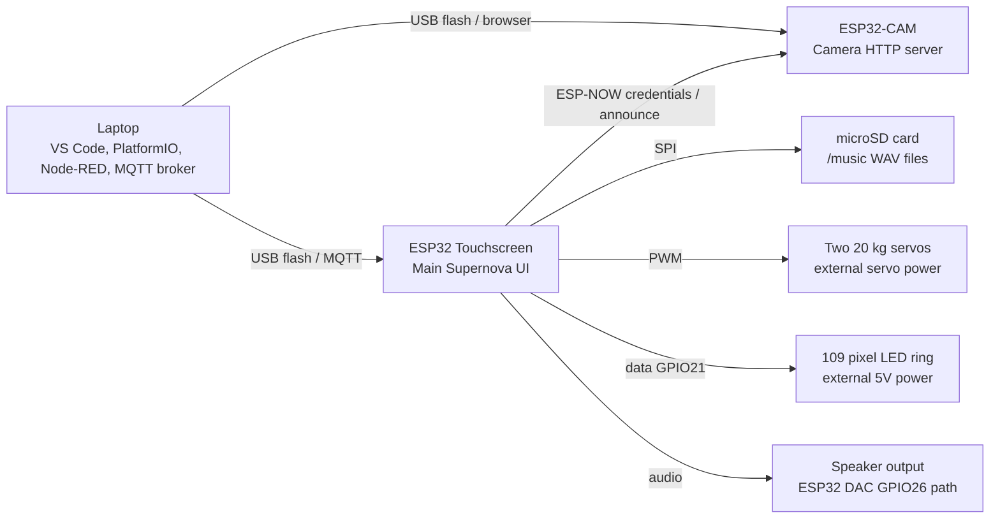

# Wiring Guide

This guide documents the current firmware pin mapping and safe wiring for the Supernova prototype.

## System Diagram



## Touchscreen Board Pins Already Used Internally

These are fixed by the diymore/LCDWiki ESP32-32E display board and the firmware.

| Function | ESP32 GPIO |
| --- | --- |
| LCD CS | GPIO15 |
| LCD DC | GPIO2 |
| LCD SCLK | GPIO14 |
| LCD MOSI | GPIO13 |
| LCD MISO | GPIO12 |
| LCD backlight | GPIO27 |
| Touch CS | GPIO33 |
| Touch IRQ | GPIO36 |
| microSD CS | GPIO5 |
| microSD SCLK | GPIO18 |
| microSD MOSI | GPIO23 |
| microSD MISO | GPIO19 |

Do not reuse these pins for extra devices.

## Current External Pin Mapping

These are defined in:

```text
esp32-touchscreen/src/supernova_devices.h
esp32-touchscreen/src/board_pins.h
```

| Device | Signal | ESP32 GPIO | Notes |
| --- | --- | --- | --- |
| LED ring | Data in | GPIO21 | Use 330 ohm resistor in series if possible |
| Servo pan | PWM signal | GPIO25 | External servo power required |
| Servo tilt | PWM signal | GPIO32 | External servo power required |
| Audio/speaker | DAC audio | GPIO26 | Current firmware uses ESP32 built-in DAC output |
| LCD backlight | PWM brightness | GPIO27 | Board backlight control |

## Servo Wiring

The RDS3218 servos must be powered from a separate servo supply/BEC. Do not power them from the ESP32 board.

| Servo Wire | Connect To |
| --- | --- |
| Pan servo signal | ESP32 GPIO25 |
| Tilt servo signal | ESP32 GPIO32 |
| Servo V+ | External servo supply positive |
| Servo GND | External servo supply ground and ESP32 GND |

Rules:

- Connect ESP32 GND to servo supply GND.
- Use a high-current supply. These servos can pull large current spikes.
- If servos vibrate or move randomly, check ground, power supply current, and signal wiring.
- Keep servo wires away from display/touch ribbon cables.

## LED Ring Wiring

The LED ring is a 5V addressable WS2812/NeoPixel style ring.

| LED Ring Pin | Connect To |
| --- | --- |
| 5V | External 5V LED supply |
| GND | External 5V supply ground and ESP32 GND |
| DIN | ESP32 GPIO21 |

Recommended protection:

- 330 ohm resistor between GPIO21 and DIN.
- 1000 uF capacitor across LED 5V and GND near the ring.
- Logic level shifter if LED data is unreliable.

Power warning:

- 109 LEDs can draw about 6.5A at full white.
- Use a strong 5V supply if high brightness is enabled.
- Current firmware keeps LED brightness low for safety.

## Audio Wiring

The current firmware plays WAV audio through the ESP32 built-in DAC path on GPIO26. This matches the display board speaker/audio interface used in the prototype.

Important:

- The current firmware does not output external I2S BCLK/LRCLK/DIN for a MAX98357A module.
- If you want to use MAX98357A, change the audio driver code first.
- Do not connect speakers directly to random ESP32 GPIO pins.

## SD Card

Use a microSD card formatted as FAT32.

Music folder:

```text
/music
```

Supported music files:

- `.wav`
- PCM format
- 8-bit or 16-bit
- mono or stereo
- up to 120 detected songs

MP3 files are not currently played by the firmware.

## ESP32-CAM Wiring

The ESP32-CAM is a separate board. It does not need signal wires to the touchscreen for normal operation.

Connections:

- USB programmer/adapter for flashing and power during development.
- Same WiFi network as the touchscreen after setup.

Communication:

- Touchscreen sends WiFi credentials over ESP-NOW.
- Camera announces its IP address back to the touchscreen.
- Camera serves HTTP endpoints over WiFi.

## Shared Ground Rule

All supplies must share ground:

```text
ESP32 display GND
LED power supply GND
Servo power supply GND
Audio/speaker GND if external
```

Without a shared ground, servo control and LED data will be unreliable.

